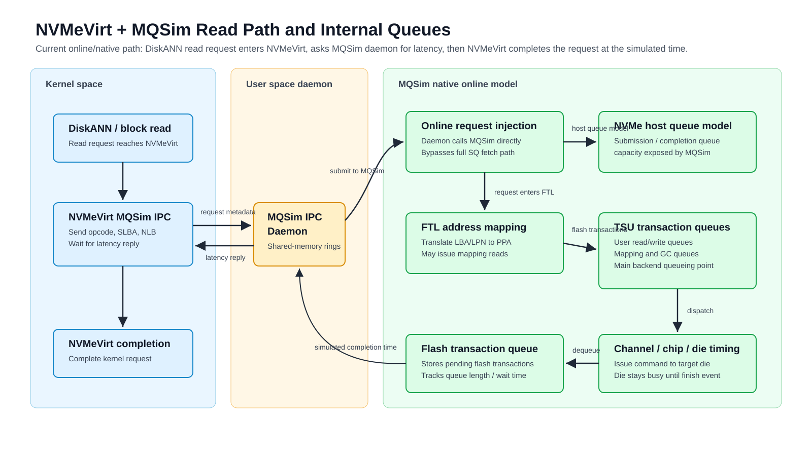

# NVMeVirt Online Integration

本專案在原本的 MQSim 之外，新增了一條 online execution path，讓 host application 可以先把資料放在 NVMeVirt block device 上，再讓 NVMeVirt 將實際 I/O request 送到 MQSim。MQSim 不讀取真實資料內容，而是使用原生 event-driven SSD model 來計算每筆 I/O 的 completion latency。

## 設計目標

這個整合的目標是讓 DiskANN、fio 或其他 host application 仍然對 Linux 裡的 NVMeVirt device 發出真實 block I/O，同時把 SSD timing 交給 MQSim 原生模型決定。

重要分工如下：

1. NVMeVirt 負責 host-facing NVMe device、真實資料 bytes 與 kernel I/O path。
2. MQSim 負責 simulated SSD timing、FTL mapping、TSU scheduling、PHY event execution、channel/LUN contention。
3. Filesystem extent metadata 只用來告訴 MQSim：哪些 host-visible LBA range 屬於已經 preload 好的 index files。
4. MQSim 不讀 `/mnt/nvmevirt` 裡的 index bytes，也不成為資料 owner。

## 新增元件

### `scripts/extract_nvmevirt_extents.sh`

此 script 使用 `filefrag -b512 -v` 讀取檔案系統 extent metadata，將 mounted index files 轉成 preload CSV：

```text
file,file_offset_bytes,slba,nlb
```

其中 `slba` / `nlb` 是 host-visible 512B sector address。這些位址之後會被 MQSim 視為已經存在於 SSD logical address space 中的 valid data。

### NVMeVirt MQSim IPC endpoint

NVMeVirt kernel module 建立 `/dev/nvmev-mqsim-ipc`，並透過 shared-memory ring buffer 與 userspace daemon 溝通。每筆 I/O request 會包含：

```text
request_id
submit_time_ns
opcode
namespace / queue / command id
slba
nlb
```

daemon 回覆：

```text
request_id
latency_ns
status
```

NVMeVirt 仍然處理真實 data path；MQSim 只回傳 timing。kernel 端採用 async pending completion：已送給 MQSim 的 command 會留在 pending work 裡，host submit path 不會同步等待 daemon，等 daemon 回覆後才更新該 command 的 completion target time。

#### IPC shared memory implementation detail

`/dev/nvmev-mqsim-ipc` 不是資料盤，也不是另一個 SSD namespace。它是 NVMeVirt kernel module 註冊給 daemon 使用的 character device。daemon 透過這個 device 取得 shared-memory IPC 區域：

```text
NVMeVirt kernel module
  |
  | vmalloc_user(mqsim_shm)
  v
kernel-owned shared memory object
  |
  | mmap handler: remap_vmalloc_range()
  v
MQSimIPCDaemon userspace mapping
  |
  +-- req_ring / req_entries[]
  +-- resp_ring / resp_entries[]
```

這條 IPC shared memory path 和 NVMeVirt backing store 不同：

```text
backing store:
  memmap=... at boot
  memremap() in NVMeVirt
  stores real DiskANN/index bytes

IPC shared memory:
  vmalloc_user(mqsim_shm) in NVMeVirt
  mmap(/dev/nvmev-mqsim-ipc) in MQSimIPCDaemon
  stores only request/response metadata
```

因此 request/response ring 裡只會放 `request_id`、`opcode`、`slba`、`nlb`、`latency_ns` 等 metadata；真正的 file data bytes 仍由 NVMeVirt backing store 負責保存與回傳。

### `MQSimIPCDaemon`

`MQSimIPCDaemon` 是 userspace bridge。它會：

1. 啟動並初始化 MQSim native online model。
2. 在 host query I/O 開始前讀取 extent preload CSV。
3. 將 preload LBA range 轉成 MQSim online write requests，讓 MQSim 原生 FTL 建立 mapping。
4. 監聽 `/dev/nvmev-mqsim-ipc`。
5. 將 NVMeVirt 傳來的 I/O request 注入 MQSim event engine。
6. 在 userspace event loop 中持續推進 MQSim event queue，直到產生 completion。
7. 把 completion latency 回給 NVMeVirt。

daemon 端目前是 busy-loop/event-loop style：當 kernel request ring 有資料或 MQSim 裡仍有 pending request 時，daemon 會持續 drain request ring、呼叫 MQSim `Run_next_event()`，並把完成的 replies 寫回 response ring。相對地，NVMeVirt kernel 端不 busy wait MQSim；它只保留 pending I/O，等待 daemon 以 ioctl 通知 response。

目前支援的 timing modes：

```text
--model fixed
--model native
--model online
```

其中 `native` 與 `online` 都代表真正使用 MQSim 原生 event-driven path。舊版未接 MQSim 原生 FTL/TSU/PHY 的 lightweight prototype 已移除。

### `MQSimNativeOnlineModel`

`MQSimNativeOnlineModel` 是 MQSim 原生模型的 online wrapper。它會初始化：

```text
SSD_Device
Host_Interface_NVMe
Data_Cache_Manager_Flash_Simple
FTL
Address_Mapping_Unit_Page_Level
Flash_Block_Manager
GC_and_WL_Unit_Page_Level
TSU
NVM_PHY_ONFI
```

它新增的 online 行為是：

1. 建立單一 NVMe stream，覆蓋整個 device LBA range。
2. 提供 `preload_write(slba, nlb)`，在 host I/O 前用 MQSim 原生 write path 建立 FTL state。
3. 提供 `estimate_latency_ns(req)`，將 NVMeVirt request 轉成 MQSim `User_Request`。
4. 使用 MQSim `Engine::Run_next_event()` 一步步推進 event queue，直到該 request completion。
5. 透過 MQSim PHY transaction completion signal 統計 channel/LUN distribution。

### MQSim Engine online stepping

原本 MQSim 的 `Engine::Start_simulation()` 會一次跑完整個 offline workload。online mode 新增：

```text
Prepare_simulation()
Run_next_event()
Fast_forward(time)
```

這讓 daemon 可以在每筆外部 I/O 到來時，把 simulator time 對齊 request submit time，然後只跑到該 request 完成。

### NVMe Host Interface online submit

原本 `Host_Interface_NVMe` 假設 request 來自 MQSim host/PCIe submission queue。online mode 新增一個直接注入 request 的 API，讓 daemon 可以建立 MQSim `User_Request`，但仍沿用原生 segmentation、cache manager、FTL、TSU、PHY 流程。

對 online preload write，MQSim 不會從 host memory DMA 真實資料 bytes，而是直接走 write segmentation 與 FTL allocation path。這是因為真實資料已經存在 NVMeVirt backing store；MQSim 只需要 timing/layout metadata。

## 執行架構

```text
                 preload phase, before host query I/O

  DiskANN index files on /mnt/nvmevirt
                  |
                  | filefrag extent metadata
                  v
        scripts/extract_nvmevirt_extents.sh
                  |
                  | CSV: file,file_offset_bytes,slba,nlb
                  v
          MQSimIPCDaemon --model native
                  |
                  | preload_write(slba, nlb)
                  v
        MQSimNativeOnlineModel
                  |
                  | native MQSim write path
                  v
  Host_Interface_NVMe -> Data_Cache -> FTL -> Block_Manager
                  |
                  v
       MQSim GlobalMappingTable / block metadata ready


                 online serving phase

  fio / DiskANN / host application
                  |
                  | read/write file on /mnt/nvmevirt
                  v
       Linux filesystem + block layer
                  |
                  | NVMe command: slba, nlb
                  v
              NVMeVirt
                  |
	                  | async pending work + shared-memory IPC request
                  v
          /dev/nvmev-mqsim-ipc
                  |
                  v
             MQSimIPCDaemon
                  |
                  | Submit_online_request()
                  v
        MQSim Host_Interface_NVMe
                  |
                  v
        Data_Cache_Manager_Flash_Simple
                  |
                  v
        Address_Mapping_Unit_Page_Level
                  |
                  | LPA -> PPA using native MQSim FTL state
                  v
                 TSU
                  |
                  v
              NVM_PHY_ONFI
                  |
                  | event-driven transaction completion
                  v
          MQSimNativeOnlineModel
                  |
	                  | latency_ns, daemon notify response
                  v
              NVMeVirt
                  |
                  v
       complete original NVMe command
```

### Online read path queue map

下面這張圖把目前 NVMeVirt + MQSim native online path 的 read request 流程，以及幾個重要 queue/timing point 放在同一張圖裡：



需要注意的是，`IO_Queue_Depth` 描述的是 MQSim NVMe host interface 的 submission/completion queue capacity；在目前 daemon 使用的 native online mode 中，request 會透過 `Host_Interface_NVMe::Submit_online_request()` 直接注入 MQSim。真正影響 backend 排隊延遲的主要位置，是 FTL 之後的 TSU flash transaction queues，以及 channel/chip/die busy timing。

## Preload 與 query 的順序

目前假設 index files 已經先寫入 `/mnt/nvmevirt`，並且 logical address layout 已經完成 block shuffling。daemon 啟動後會先完成 extent preload，再開始接 host query I/O：

```text
1. index files ready on /mnt/nvmevirt
2. extract extent CSV
3. start MQSimIPCDaemon with --preload-extents
4. MQSim native FTL builds mapping for those LPNs
5. run fio or DiskANN query
```

這代表 online read path 不會在第一次 read 時才補 mapping。理想情況下，DiskANN query 讀到的 LPN 都應該已經在 preload 階段進入 MQSim FTL state。

## 常用指令

產生 extent preload CSV：

```bash
INDEX_DIR=/mnt/nvmevirt/sift1m_diskann_index
/home/emmanuel/projects/nvmevirt-mqsim/scripts/extract_nvmevirt_extents.sh "$INDEX_DIR"/* \
  > /tmp/sift1m_nvmevirt_extents.csv
```

啟動 native online daemon：

```bash
cd /home/emmanuel/projects/nvmevirt-mqsim/mqsim

sudo ./MQSimIPCDaemon \
  --model native \
  --ssd-config ./ssdconfig.xml \
  --preload-extents /tmp/sift1m_nvmevirt_extents.csv \
  --trace-first 5 \
  --stats-every-reqs 1000 \
  --stats-top 5
```

用 fio 測 iodepth=1：

```bash
fio --name=sift-index-native-mqsim-read \
  --filename=/mnt/nvmevirt/sift1m_diskann_index/sift1m_l2_R64_L100_pq0_default_disk.index \
  --rw=randread \
  --bs=4k \
  --iodepth=1 \
  --ioengine=libaio \
  --direct=1 \
  --numjobs=1 \
  --runtime=10 \
  --time_based=1
```

檢查 IPC counters：

```bash
cat /proc/nvmev/mqsim_ipc
```

重點欄位：

```text
requests      kernel 已送進 MQSim daemon 的 I/O 數
replies       kernel 已收到並套用的 MQSim reply 數
pending       kernel 目前還在等 MQSim reply 的 I/O 數
max_pending   kernel 觀察到的最高同時 pending I/O 數
late_replies  reply 回來時 kernel 已找不到 pending request 的數量
```

## Log 與統計資料

daemon 會印出 preload 與 online request 統計，例如：

```text
MQSim native preload extents loaded. extents=12 allocated_pages=115644
MQSim shared-memory IPC daemon connected. model=native ...
MQSim online trace: request_id=... op=read slba=... nlb=... lpn=... latency_ns=...
MQSim native online stats: requests=... completed=...
  preload: write_requests=... sectors=...
  online: reads=... writes=... pending=...
  async: completed_queue=... max_pending=... events_run=...
  flash transactions: reads=... writes=... erases=...
  read channel distribution: ideal=... min=... max=...
  read lun distribution: ideal=... min=... max=...
  hottest read luns: ...
```

`flash transactions` 與 channel/LUN 統計來自 MQSim native PHY transaction completion signal，因此統計的是 MQSim 原生 event-driven path 實際完成的 flash transactions。

如果要列出每個 LUN 的完整統計，可以加：

```text
--stats-full
```

## 多筆 I/O 的處理方式

kernel 端與 daemon 端都已經不是「收到一筆就立刻同步 drain 一筆」的模型，但兩邊等待方式不同：MQSim daemon 端是 userspace busy-loop/event-loop，NVMeVirt kernel 端是 async pending completion。

NVMeVirt kernel 收到 read/write command 後，會先照原本流程建立 `nvmev_io_work`，但如果 MQSim IPC 啟用，該 work 的 completion target 會先設成等待狀態，並綁定一個 MQSim `request_id`。接著 kernel 把 request 寫進 shared-memory request ring，host submit path 不會同步等待 MQSim 算完。

daemon 端會先把 request ring 裡目前可讀到的 requests 全部送進 MQSim `Host_Interface_NVMe::Submit_online_request()`，每一筆 `User_Request *` 都會放進 pending table。之後 daemon 反覆呼叫 `Run_next_event()` 推進 MQSim event queue，等 MQSim 原生 completion callback 回來時，再把對應的 reply 放進 completed queue，最後寫回 NVMeVirt response ring。

NVMeVirt kernel 收到 daemon response notification 後，會依 `request_id` 找回原本的 pending work，把 completion target 更新成 `submit_time_ns + latency_ns`。原本的 NVMeVirt I/O worker 之後會照常做 payload copy、填 CQE、發 interrupt。

這代表 kernel 與 MQSim userspace 兩邊都可以承接「多筆 request 同時 pending」以及 out-of-order completion。kernel 的 `/proc/nvmev/mqsim_ipc` 裡 `max_pending` 可以檢查 host/NVMeVirt 端是否真的有多筆 outstanding I/O；daemon stats 裡的 `async.max_pending` 則可以檢查 MQSim userspace 端觀察到的最高 pending 數。

## 目前限制

目前 async path 沒有 per-request timer。若 request 已成功送進 daemon 但 daemon 後續卡住，該 I/O 會等到 daemon disconnect 時才用 NVMeVirt local timing fallback 放掉。因此實驗時建議同時觀察 `/proc/nvmev/mqsim_ipc` 的 `pending` 和 daemon log 的 completed request 數。

另外，NVMeVirt 仍然負責搬真實資料 bytes；MQSim 不會讀取 DiskANN index 的內容，只模擬 host-visible LBA 對應到 MQSim FTL/flash transaction 後的 timing。
