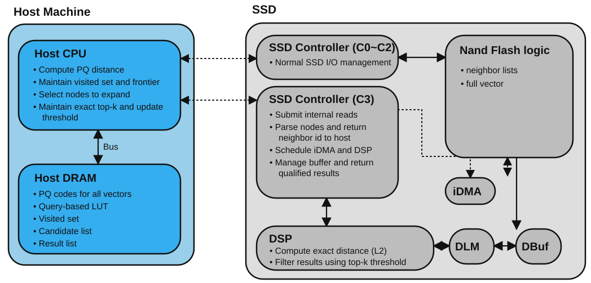

# Host–SSD Codesign: VUC and Simulator Plan

## Research question

At a fixed search quality (recall), does offloading batched node expansion and
candidate distance filtering from the Host to SSD controller C3/DSP improve
query latency or throughput? Which resource (NAND, C3, iDMA, DSP, or DBuf) limits
the gain?

The VUC is the mechanism used to submit work to C3. The outcome of interest is
end-to-end search performance, not command latency by itself.

## Target architecture

The dotted Host links show the two logical request paths: ordinary NVMe I/O is
handled by C0-C2, while search VUCs are routed to C3. The drawing is a logical
architecture view; it does not by itself specify the physical NVMe function,
queue mapping, or DMA command format.

## First model boundary

Use one VUC per batch of nodes selected by the Host. The Host continues to own
the priority queue/frontier, visited set, and exact top-k threshold. C3 reads
the requested nodes' adjacency lists and vectors, performs the modeled neighbor
parsing and distance/filter work, and returns qualified candidates. This keeps
the initial comparison focused on placement of work; C3 does not choose the
next frontier in this version.

Keep ordinary NVMe reads/writes on the current C0–C2 path. Route only the
search VUC to C3. Initially, identify VUC as a distinct simulator request type;
do not pretend an existing read opcode is a VUC. The existing online IPC path
accepts only READ/WRITE, and its NVMeVirt callback runs before IPC submission.
Therefore command recognition, data-buffer transfer, and completion semantics
must be added together before claiming a real NVMeVirt-to-C3 path.

## VUC v1 semantic contract

One command represents one query batch:

Copy-ready field list:

query_id — Correlates commands and results belonging to one query.

batch_id — Monotonic batch number within the query.

node_count — Number of Host-selected node IDs in the input list.

node_list_ref, node_list_bytes — DMA-visible descriptor/buffer reference and
byte length for node IDs.

top_k — Maximum number of candidates returned for this batch.

threshold — Current Host-provided distance threshold, with a documented
numeric format.

result_ref, result_capacity — DMA-visible result buffer and capacity.

Completion reports status, number of candidates returned, bytes moved, and the
usual request correlation fields. The node ID and result arrays live in DMA
buffers, not inline in the command or IPC ring entry. The first simulator
prototype may represent buffer references as opaque IDs, but it must account
for descriptor/data bytes and the modeled transfer bandwidth. It must also
define behavior for a full result buffer (return a bounded result plus an
overflow status, rather than silently dropping candidates).

## Relationship to standard NVMe commands

“Using the NVMe command format” and “being compatible with standard NVMe
semantics” are different. A VUC can use the existing 64-byte submission queue
entry and repurpose fields or a vendor-specific opcode, while requiring custom
SSD firmware and a custom host interface. A standard driver/device will not
know what the search fields mean. Do not silently overload ordinary READ or
WRITE semantics.

InstANNS is a relevant precedent: its IPQF is described as a custom NVMe
command, and it repurposes the DSM command format and its fields for query-aware
PQ filtering. The paper says existing hardware and storage drivers do not
support IPQF; the authors implemented it using NVMeVirt and SPDK. It also
explains that input transfer and result retrieval need separate write/read
operations under NVMe command semantics, and addresses their ordering as a
paired operation. This supports reusing the NVMe transport/command envelope,
not claiming stock-driver compatibility. The paper's operation is specifically
PQ filtering; its exact command layout should not be copied for our graph-node
expansion unless the payload and completion behavior match.

For our first simulator implementation, keep SEARCH as a distinct IPC/model
request type. Later choose one concrete NVMe interface: (A) one vendor command
with host-provided input/output DMA buffers and a single completion, or (B) a
paired input command and result-read command linked by query/batch ID. Option A
fits a direct C3 request/response abstraction; option B is closer to a design
where the SSD accepts a write-like input and exposes output for a subsequent
read. Whichever is selected, model data movement and ordering explicitly.

## Simulator changes, in implementation order

1. **Request ABI and dispatch**: add a versioned SEARCH/VUC request type to the
   shared IPC protocol, carrying the semantic fields above. Preserve READ and
   WRITE behavior. Have NVMeVirt recognize only the chosen vendor opcode and
   submit it asynchronously through the same request-ID/pending completion
   machinery. Define a valid command data-buffer format and failure status.
2. **C3 work queue**: add a separate C3 queue and configurable command service
   slots/service cost. Queue wait and service time are separate statistics.
3. **NAND reads**: map requested node IDs to configured logical addresses and
   inject internal reads through MQSim's existing FTL/TSU/PHY path. These reads
   must contend with ordinary C0–C2 traffic for NAND channels/chips/dies.
4. **iDMA and DBuf**: model bytes and transfer bandwidth for adjacency/vector
   movement. Give DBuf finite capacity and hold/release buffer slots at defined
   producer/consumer points so full-buffer backpressure can delay future reads.
5. **DSP**: schedule exact-distance work with configurable parallel units and
   service cost derived from vector dimension and candidates processed. Record
   DSP queue wait separately. Return qualified candidates and completion status.
6. **Host search loop**: initially model Host-side PQ/visited/frontier work as
   configurable service and memory traffic. Later, replace the synthetic loop
   with the actual search implementation if recall-quality experiments require
   it.

Make service capacities, latencies, vector dimension, adjacency bytes, and
DBuf capacity explicit parameters. Do not bury all of these in one fixed DSP
delay: that would not reveal which resource causes a bottleneck.

## Comparison and outputs

Compare Host-only and C3/DSP-offload with identical graph, query set, initial
frontier, batch policy, and recall target. Sweep query concurrency and batch
size; then sweep DSP units/speed, iDMA bandwidth, and DBuf capacity.

Primary metrics:

- query latency: mean, P95, and P99;
- QPS at the same recall target;
- stage latency: Host, command transport, C3 queue/service, NAND, iDMA,
  DSP queue/service, and result return.

Diagnostic metrics:

- NAND read count and channel/die queue wait;
- C3 and DSP queue depth/wait and busy time;
- iDMA bytes and transfer wait;
- DBuf occupancy, full cycles, and backpressure time;
- candidates returned, filtered, and buffer-overflow count.

Every timestamp should use the simulator's event-time domain. Report warmup and
preconditioning state because cold mapping reads and steady-state SSD behavior
can produce materially different results.

## Hardware feedback and modeling assumptions

The current hardware feedback gives these constraints for the first model:

- A batch of 32 × 4 KiB or 128 × 4 KiB is submitted with one SQ/CQ pair. Model
  command/queue overhead once per batch, and model the payload/data work by its
  byte count. Do not charge one host SQ/CQ round trip per 4 KiB unit.
- Internal NAND reads are asynchronous, with a maximum outstanding depth of
  16. Model an internal read queue with configurable depth and use 16 as the
  hardware-reported limit. Larger batches may require multiple waves of reads.
- DBuf's allocation/transfer unit is 4 KiB. The current measurements do not
  establish throughput below 4 KiB, so do not extrapolate a sub-4-KiB rate.
- Data entering DBuf and data moving from DBuf to DLM use the same hardware
  channel and cannot overlap. Model these transfers as mutually exclusive
  stages on one serialized resource. Although data movement and update may
  overlap in the experimental workflow, their throughputs were measured
  separately; do not infer a combined simultaneous throughput from those
  numbers.
- PQ ADC kernel cost and full-vector distance cost are not currently known.
  Keep them as explicit configurable parameters, label any assumed values, and
  sweep them in sensitivity analysis. Do not present a point estimate based on
  invented compute latency as a measured result.

These constraints refine, but do not alter, the VUC contract: one command still
describes one node batch. In the timing model, separate host SQ/CQ overhead,
internal async NAND reads, serialized DBuf-channel transfers, DSP/PQ work, and
completion. Record the time each stage waits for its resource so that the
16-read limit and shared-channel serialization are visible in results.

Suggested first batch sweep: 32 × 4 KiB and 128 × 4 KiB, with internal read
depth 1, 4, 8, and 16. Keep DBuf transfers in 4 KiB quanta. For the unknown
compute stages, report curves over a range (including zero-cost and
compute-dominated cases) until hardware measurements are available.

## What the first implementation should claim

The first end-to-end prototype should claim only that it models the defined
Host-selected batch path and its resource contention. It should not claim
ANN-level speedup or fixed-recall improvement until the same graph/query search
semantics and recall are actually evaluated. Validate the model in layers:
zero-cost C3/DSP controls, isolated resource sweeps, then mixed ordinary I/O and
search traffic.
