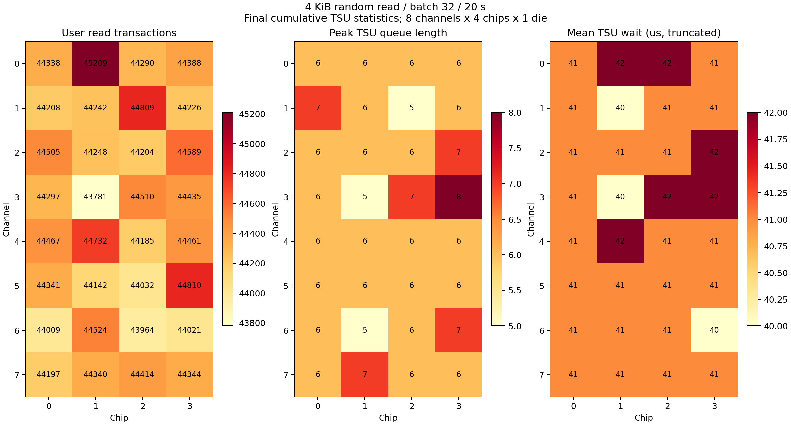

# 4 KiB random read / batch 32 TSU 分佈分析

設定：20 秒、6 GiB 隨機位址範圍、seed 12346、無 warmup/preload、nonideal mapping、coalesce 6 us / max 32。8 channels × 4 chips × 1 die。來源：同目錄原始 log、設定及 benchmark.csv。

User read TSU 共 1,419,262 筆；32 個 chip 每個 43,781–45,209 筆，占總量 3.0848%–3.1854%（理想 3.125%）。交易量 population CV=0.625%。
各 chip 平均 TSU 等待（log 整數截斷）40–42 us，queue 峰值 5–8；最長等待 691 us。全部 user read queue 最終為空。
全體 user_read timing：Submit2TSUEnq=17.16 us、TSUWait=41.60 us、DieExec=75.02 us、DataWait=2.62 us。TSUWait 不能分解為 channel 與 die 個別等待。

| Channel | User reads | Share (%) | MaxQLen（各 chip 最大值） | MaxWait (us) |
|---|---:|---:|---:|---:|
| 0 | 178225 | 12.5576 | 6 | 565 |
| 1 | 177485 | 12.5054 | 7 | 573 |
| 2 | 177546 | 12.5097 | 7 | 574 |
| 3 | 177023 | 12.4729 | 8 | 691 |
| 4 | 177845 | 12.5308 | 6 | 525 |
| 5 | 177325 | 12.4942 | 6 | 536 |
| 6 | 176518 | 12.4373 | 7 | 530 |
| 7 | 177295 | 12.4921 | 7 | 568 |

## 判讀與限制

讀取交易量和平均 TSU 等待在各 chip 間相近；存在短暫排隊，但沒有明显的累積讀取負載偏斜。累積統計無法證明每個時刻都平均，也沒有 queue 深度時間序列。
Mapping write 共入隊 3,066 筆、出隊 0 筆、最後剩餘 3,066 筆，各 chip 剩餘 92–99 筆；原因未查明。AvgWait=0 不能解釋為沒有等待，因為尚無出隊樣本。
AvgQLen 及 chip utilization 的 0.00 不可用來宣稱無競爭；online 絕對時間基準下，平均值分母存在稀釋問題。本報告不據此計算容量使用率。
Benchmark 記錄 1,419,264 I/O，而 daemon 與 IPC 前後差值都是 1,419,262，相差 2 筆，原因未確認。TSU 分析只涵蓋 daemon 實際記錄的交易。IPC requests=replies、pending=0，timeouts/fallbacks/send_errors/req_ring_full 本次增量均為 0。
這是無 preload 的冷啟動測試；mapping read_no_ppa_creations=657140，不代表預先填滿／穩態 SSD。Host batch=32 不表示所有交易會同時進入 TSU。

完整逐 queue 數據：tsu_queues.csv；逐 channel 數據：tsu_channels.csv。
